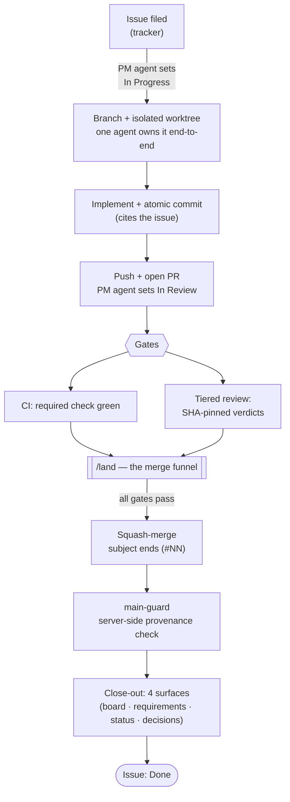
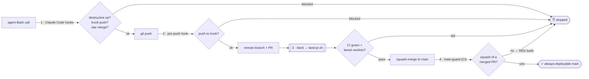
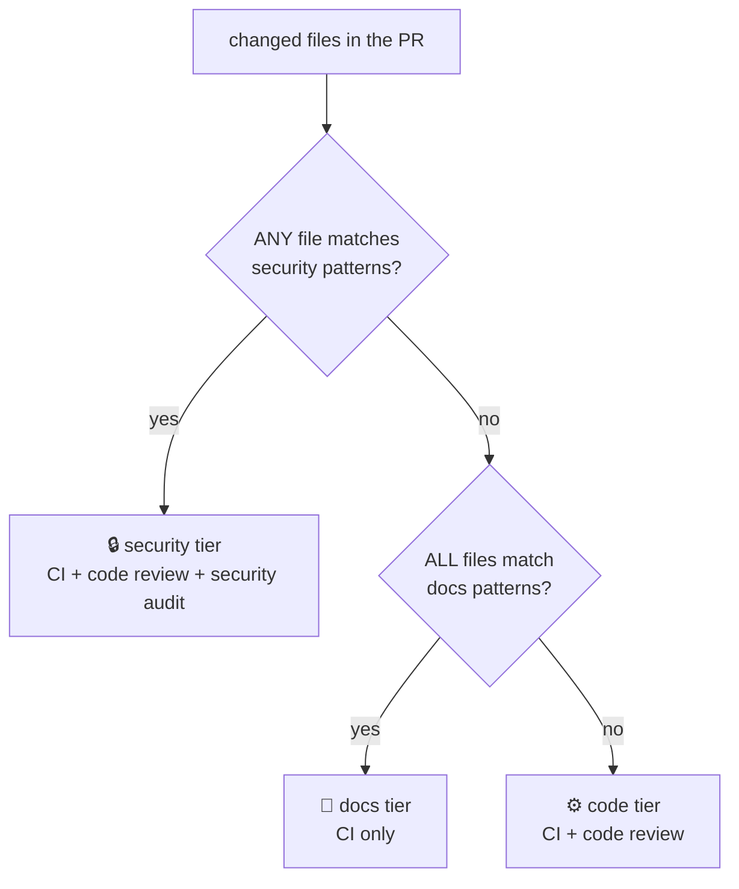

# agent-pr-flow

**Delivery governance for agent-driven engineering — encoded as mechanism, not discipline, for $0.**

When autonomous coding agents write and land code, the hard part isn't the code — it's the
*governance*: making sure every change reaches your trunk safely, reviewably, and traceably,
**without** a human becoming the bottleneck and **without** paying for enforcement infrastructure.

`agent-pr-flow` is a portable bundle that turns a delivery process into **running machinery**. Drop
it into any GitHub repo and you get a trunk that stays always-deployable, a single gated path to
merge, a project board that can't drift out of sync with reality, and a tiered review model that
scales scrutiny to risk — all enforced by hooks, scripts, and a CI check instead of by people
remembering the rules.

It was extracted from a real project ([the reference instance](#the-reference-instance)) where a
fleet of agents ships features in parallel. It runs on a **free-tier private repo** — the design
constraint that forced every gate to be a $0 mechanism rather than a paid GitHub feature.

---

## Why a PM / Program Manager should care

You are increasingly accountable for delivery that is *executed by agents*. That raises governance
questions a Gantt chart can't answer:

| The governance question | How this answers it |
|---|---|
| **How do I keep velocity without losing control?** | Agents run in parallel, each isolated; the gates are automatic, so nobody waits on a human to "approve the process." |
| **Is my board telling the truth?** | Issue state is driven by the git lifecycle (PR opened → *In Review*, merged → *Done*) and a background PM agent, so the tracker reflects reality, not optimism. |
| **Can I prove what shipped and why?** | Every merge is the squash commit of one reviewed PR, subject-tagged `(#NN)`, linked to an issue, with the review verdicts recorded on the PR. Full audit trail, automatically. |
| **How much scrutiny does *this* change need?** | Changes are auto-classified into **docs / code / security** tiers; scrutiny scales to risk instead of one-size-fits-all. |
| **What does this cost?** | $0. No paid branch protection, no merge-queue product, no seats. |
| **What happens if an agent misbehaves or drifts?** | Four independent layers block or detect an out-of-process change — defense in depth, not a single point of trust. |

The mental model: **process is only real if it's mechanical.** A rule that lives in a wiki is a
suggestion; a rule that lives in a pre-merge hook is a control.

---

## The delivery lifecycle

One issue flows to *Done* on rails. The PM agent keeps the board honest in the background; the
merge only happens through one funnel that runs every gate first.



---

## Four mechanisms, defense in depth

Every gate that *can* be mechanical *is*. A change trying to reach trunk out-of-process meets four
independent controls — three that **prevent**, one that **detects** whatever slips through.



| # | Layer | Binds | Prevents / detects |
|---|---|---|---|
| 1 | **Claude Code hooks** (committed, so every session/worktree inherits them) | every agent shell command | destructive ops, trunk-moving pushes/commits, raw `gh pr merge`, hook-evasion attempts |
| 2 | **git pre-push hook** | any local push from any terminal | direct pushes to the trunk |
| 3 | **The merge funnel** (`land-pr.sh`, invoked by `/land`) | the merge itself | merging without a green CI check and the required review verdicts |
| 4 | **main-guard** (a CI workflow) | server-side, after every push to trunk | anything that reached trunk *not* as a reviewed PR's squash commit → the build goes red |

Because branch protection isn't available on a free private repo, mechanism 4 is the honest
backstop: it can't *stop* an out-of-process commit, but it makes one **loudly visible**. The other
three stop the ways an agent would actually get there.

> **The funnel trick:** the hooks block a raw `gh pr merge`, but `land-pr.sh` runs the merge
> *inside its own process* — invisible to the hook, which only sees top-level shell commands. So the
> only merge path an agent has is the script, and the script runs every gate first. Deny-rules, no
> allowlist. ([details](docs/architecture.md#the-funnel-trick))

---

## Scrutiny scales to risk: the review tiers

Not every change deserves the same review. `land-pr.sh` classifies a PR by its changed files and
gates accordingly — so docs move fast and anything touching the gates themselves gets the deepest
review.



The **security** patterns include a *self-protection set*: the hooks, the funnel scripts, the CI
workflows, and the config that drives all of them. Changing the gates themselves is the one thing
that always demands the strictest review — the control protects its own configuration.

---

## What's in the box

```
hooks/          Claude Code safety hooks — the agent-Bash gate + secret tripwire + config-driven lint
githooks/       the pre-push trunk guard
scripts/        land-pr.sh (the funnel) · setup-repo.sh (the doctor) · test suites
ci/             main-guard.yml (the server-side provenance detector)
agents/         radar.md — the background PM agent that keeps the board honest
commands/       /land · /issue · /linear-triage slash commands
references/     the canonical engineering-workflow reference + tracker platform reference (templated)
templates/      workflow.config.example.json — one JSON file configures an instance
settings.fragment.json   the hook wiring merged into the target repo's Claude settings
install.sh      copies + renders everything into a target repo, then runs the doctor
```

One `workflow.config.json` per repo parameterizes the whole thing — tracker coordinates, the trunk
name, the required CI check, the tier patterns, the review markers, which agents fill which
stations. The scripts read it at runtime; the docs are rendered from it at install time.

---

## Quick start

Requirements: `bash`, `jq`, `git`, and an authenticated `gh` CLI.

```bash
# from a clone of this repo, into your target repo:
bash install.sh --target /path/to/your-repo --config your-workflow.config.json
```

`install.sh` copies every artifact to its destination, renders the config placeholders, merges the
hook wiring into your Claude settings, and runs the repo doctor. Then commit the installed files
(the enforcement only reaches worktrees and CI once committed) and apply the one-time repo
settings the doctor checks for.

Full walkthrough — config schema, the console ops, verification, uninstall — in
**[docs/adoption.md](docs/adoption.md)**.

---

## Dig deeper

- **[docs/architecture.md](docs/architecture.md)** — the four mechanisms in depth, the funnel
  trick, the threat model, what's mechanical vs. what stays convention, and the escape hatches.
- **[docs/workflow.md](docs/workflow.md)** — the full engineering loop, the review-tier policy, the
  parallel-agent orchestration model, and the 4-surface close-out.
- **[docs/adoption.md](docs/adoption.md)** — install, configure, verify, and adopt it in your own
  repo, plus uninstall.

---

## The reference instance

This bundle was extracted from **endurance-logger**, an Android app built almost entirely by
autonomous agents, where it governs a fleet shipping features in parallel. The scripts carry that
project's values as *fallbacks* (an Android trunk named `main`, its tier patterns, its CI check
name) — every one is overridden by your `workflow.config.json`, so a configured instance never
touches them. They're left visible on purpose: this is a real system lifted from real use, not a
sanitized demo.

## Lineage

The design is recorded in three architectural decisions in the reference instance: trimmed GitHub
Flow (branch-per-issue, PR-only trunk), parallel agent-per-PR orchestration, and the mechanical
$0 gate stack that this bundle packages. See **[docs/architecture.md](docs/architecture.md)** for
the reasoning.

## License

[MIT](LICENSE) © 2026 Jason J. Garcia. Contributions and forks welcome — if you adopt it, the
`workflow.config.json` is the only file you should need to write.
