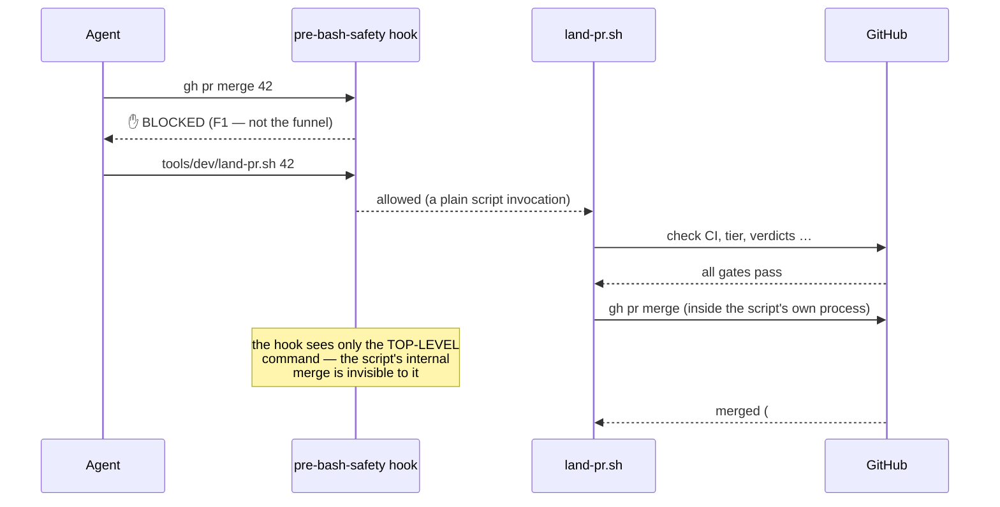

# Architecture — the $0 four-mechanism enforcement stack

This document explains *how* agent-pr-flow makes a delivery process mechanical, and — just as
importantly — *where it deliberately stops*. The guiding constraint: a **free-tier private GitHub
repo has no branch protection** (the API returns 403 without a paid plan or a public repo). Every
gate here is therefore a $0 mechanism you own, not a GitHub feature you rent.

## The problem it solves

Autonomous agents can produce correct code quickly. What they lack, out of the box, is *delivery
discipline*: nothing stops an agent from committing straight to the trunk, force-pushing over
history, merging its own unreviewed work, or quietly leaving the issue tracker stale. On a solo or
free-tier repo there's no server-side gate to lean on. Written process ("always open a PR") is only
as reliable as the agent's memory of it — and under parallel, long-running sessions, memory drifts.

The fix is to make the process **executable**. Four independent layers turn each rule into a
control.

## The four mechanisms

### 1. Committed Claude Code hooks — bind every agent shell command

The hooks live in the repo and are wired by a **committed** settings file, so every session, every
git worktree, and every fresh clone inherits them automatically. They run on the agent's shell
tool:

- **`pre-bash-safety.sh`** — a `PreToolUse` gate. It splits a compound command into segments,
  normalizes each (strips quotes, wrapper prefixes like `sudo`/`env`, and inline `VAR=` assignments
  so they can't be used to dodge a rule), then runs a decision table:
  - **D-rows — destructive-op guards:** `git reset --hard`, `git clean -f`, `rm -rf` on protected
    roots, force-push, staging secret-shaped files, serial-less device commands, and inline
    escape-hatch assignments (**D0**).
  - **F-rows — branch-flow guards:** raw `gh pr merge` (**F1** — see [the funnel trick](#the-funnel-trick)),
    any push whose refspec resolves to the trunk (**F2**, analyzed token-wise so a branch merely
    *named* `…-main-…` still passes), bare push while on trunk (**F3**), history-writing git on
    trunk (**F4**), trunk deletion (**F5**), and hook-evasion signals like `--no-verify` (**F6**).

  It **fails closed** without `jq`, and every rule matches a normalized copy so quoting or prefixing
  can't slip a command past it.
- **`post-bash-secret-scan.sh`** — a `PostToolUse` advisory tripwire that scans command output for
  secret-shaped strings (cloud keys, tokens, private-key blocks) and warns without ever printing the
  matched value.
- **`lint-on-edit.sh`** — a `PostToolUse[Edit|Write]` hook that runs a configured lint command on
  each edited file; a `null` config value makes it a fast no-op.

Because the hooks bind the *agent's* shell, they are the first and broadest line — they stop the
ways an agent would actually move the trunk before any git even runs.

### 2. `.githooks/pre-push` — bind every local push

A standard git pre-push hook, wired via `core.hooksPath` (set by the repo doctor). It rejects any
push that updates the trunk ref, from **any** terminal — not just agent sessions. Worktrees share
one git config, so a single setup covers them all. (`git push --no-verify` skips it — that's a git
invariant no pre-push hook can defeat — but mechanism 1's F6 blocks agents from using that flag, and
mechanism 4 catches whatever a human does.)

### 3. `land-pr.sh` — the merge funnel (invoked by `/land`)

The single path to merge. It runs a sequence of gates and only then performs the squash-merge:

| Gate | Checks |
|---|---|
| G0 | prerequisites: `gh` authenticated, `jq` present, PR number is an integer |
| G1 | PR is open and not a draft; captures the head SHA / title / body |
| G2 | the configured **required CI check** is `SUCCESS` on the current head |
| G3 | **tier** classification from the changed files (docs / code / security) |
| G4 | **SHA-pinned verdict markers** — for code, a reviewer `APPROVE` at the current head; for security, additionally a security-auditor `CLEARED` at the current head |
| G5 | issue linkage present (warn-only) |
| G6 | squash-merge with an explicit `--subject "<title> (#N)"` and `--match-head-commit` (pins the merge to the exact reviewed SHA — a race that moved the head makes GitHub refuse) |
| G7 | verifies the landed subject via the API and fast-forwards local trunk |
| G8 | prints the close-out checklist and the audit-trail URLs |

A `--dry-run` stops after G5 and prints a per-gate PASS/FAIL table naming every missing verdict.

**Fail-closed by construction:** the tier patterns come from config, and if a pattern is empty or
compiles to an invalid expression, the script *aborts the landing* rather than silently
down-classifying a change. It also self-tests at startup that its own config file resolves to the
security tier — the control refuses to run with a config that doesn't protect itself.

### 4. `main-guard.yml` — server-side detection

A CI workflow that runs on every push to the trunk. For each pushed commit it asserts the subject
ends in `(#NN)` **and** that PR number really is a merged PR whose `merge_commit_sha` equals this
commit. A hand-crafted `(#NN)` on a direct push fails the cross-check and the build goes **red**.
Pre-existing history is grandfathered (only pushed commits are checked). It can't *prevent* an
out-of-process commit — that needs branch protection — but it makes one impossible to miss.

## The funnel trick

The elegant part. The hooks block a raw `gh pr merge` (F1), so how does the *approved* path merge?

The hook only inspects the top-level shell command an agent runs. `land-pr.sh`'s internal
`gh pr merge` runs in a child process the hook never sees. So the only merge path is the script —
and the script runs every gate first. These are **deny-rules**: nothing needs an allowlist, because
the one legitimate path is invisible to the deny.

## Threat model — what this defends against

The hooks are **defense-in-depth against agent mistakes and drift**, not a sandbox against a
determined, adversarial agent. A sufficiently motivated actor with shell access can always find an
evasion (split a command across two tool calls, obfuscate whitespace, etc.). That's an accepted
boundary, and it's *why mechanism 4 exists*: main-guard is the server-side detector for anything
that gets through the client-side gates. The realistic failure this stack is built to stop —
an agent that forgets the process, or a long session that drifts — it stops cold.

## What is mechanical vs. what stays convention

**Mechanical (a bypass is blocked or detected):**

- Destructive ops, inline escape-hatch assignments, hook-evasion signals, raw `gh pr merge`, and any
  push/commit that moves the trunk — all blocked at the agent's shell.
- Direct trunk pushes from any terminal — blocked by pre-push.
- Merging without a green CI check and the required verdicts — blocked by the funnel.
- An out-of-process commit reaching trunk — turned red by main-guard.

**Convention (relies on discipline, not machinery):**

- **Verdict comments are agent-authored** and spoofable in principle. The $0 mitigation is the
  audit trail: every verdict is a comment on the PR, the merge subject links the PR, and main-guard
  ties the commit to it — so a forged approval is *reconstructable*, not hidden.
- **A human running `gh pr merge` in their own terminal is ungated** — the hooks bind agent shells,
  not human ones. Human discipline covers this; main-guard catches a mistake.
- **Review quality itself** — the gate checks that a SHA-pinned verdict *exists*, not that the
  review was thorough. Reviewer quality is a human/agent responsibility.

Naming these honestly is the point: you know exactly where the machine ends and where trust begins.

## Escape hatches — repo-owner-only

Four ambient environment variables let the repo owner deliberately override a guard:
`SKIP_BASH_SAFETY` (the whole Bash gate), `ALLOW_DESTRUCTIVE` (D1/D2/D6),
`ALLOW_MAIN_PUSH` (F2/F3/F4 + pre-push), `ADB_NO_SERIAL_OK` (serial-less device commands). They work
**only as ambient env in the shell that launched the session** — the hooks read their own
environment, so an inline `VAR=1 command` never reaches them *and* is blocked outright (D0). F1 (raw
merge) and F5 (trunk deletion) have **no** hatch. Agents never set these; when a legitimate command
trips a guard, the remedy is to author the content with editor tools instead of a shell heredoc, not
to flip a hatch.
