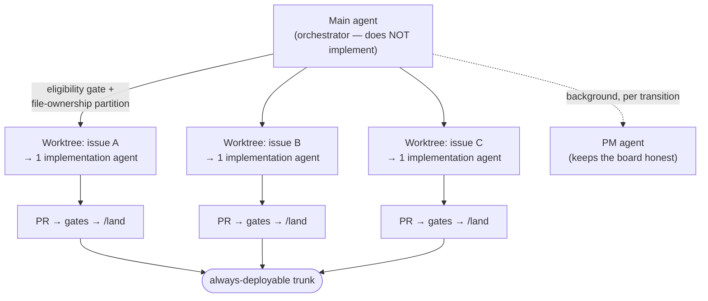

# The engineering workflow

How work actually moves through agent-pr-flow, from an issue to a merged, deployable trunk. This is
the human/agent process the four mechanisms *enforce*; the mechanisms are in
[architecture.md](architecture.md).

The canonical, config-rendered version of this reference installs into a target repo as
`.claude/references/pm/workflow.md` (from `references/workflow.md.tmpl`). This document is the
narrative overview.

## The loop, per issue

1. **Pick up** — a background PM agent sets the issue to *In Progress* the moment work starts (the
   easy-to-forget transition).
2. **Branch** — cut from a fresh trunk, named so the tracker auto-links the PR.
3. **Worktree** — one isolated git worktree per issue, so parallel agents never share a working
   directory. Per-machine gitignored files (build config, credentials) are copied in.
4. **Implement** — one agent owns the issue end-to-end; new field-discovered behavior is written to
   the requirements doc, not buried in code comments.
5. **Commit** — atomic commits with a typed subject that cites the issue.
6. **Push + PR** — the owning agent pushes and opens the PR; the PM agent moves the issue to
   *In Review*.
7. **Gates** — CI plus tiered review; reviewers post SHA-pinned verdict markers on the PR.
8. **Land** — `/land <PR#>` runs the funnel. Never a raw `gh pr merge` (it's blocked).
9. **Close out** — the four surfaces below, then the worktree is removed.

## One issue → one branch → one worktree → one agent

The cardinal rule of parallel agent work: **never two agents in one working directory.** Two agents
sharing a checkout will step on each other — one cutting a branch under the other mid-build. Git
worktrees give each agent its own working directory sharing one `.git`, so a fleet can run in
parallel without collision.

The **main agent orchestrates and does not implement**: it applies an *eligibility gate*
(independent · well-specified · low-ambiguity · unblocked), **partitions work by file ownership** so
two PRs can't collide, sequences dependent merges, and escalates open questions to a human. Ambiguous
or tightly-coupled work stays serialized rather than fanned out.

## Review tiers

`land-pr.sh` classifies each PR by its changed files and scales review to risk:

- **docs tier** — *all* changed files match the docs patterns → **CI alone** lands it.
- **code tier** — anything else → **CI + a code-review verdict** (`APPROVE`, SHA-pinned).
- **security tier** — *any* file matches the security patterns → **CI + code review + a security
  audit** (`CLEARED`, SHA-pinned).

**Precedence:** any security match wins; else all-docs wins; else code. The security patterns
include a **self-protection set** — the hooks, the funnel scripts, the CI workflows, and the config
that drives them — so changing the gates themselves always demands the deepest review.

**SHA-pinning + delta review:** a verdict marker names the exact head SHA it approved. Any push
voids prior verdicts; the funnel trusts only the *last* marker per reviewer at the *current* head.
A trivial follow-up push gets a fresh delta review rather than a blanket re-approval. This is why a
race that moves the head makes the merge refuse — the gates and the merge assert the same SHA.

Reviewers, security auditors, tests, and acceptance checks are **stations**; the config maps each
station to an agent. Setting a station to `null` disables its gate with a loud warning, so an
instance can run with a lighter review model on purpose, visibly.

## Close-out — the four surfaces

When a PR lands, exactly four things are reconciled (the funnel's final gate prints this checklist):

1. **Tracker** — the PM agent verifies the issue reached *Done* (the tracker↔GitHub integration
   usually drives it off the `Fixes #NN` link; the agent's pass is idempotent verification).
2. **Requirements** — the durable requirements doc is updated *only if* a quality bar moved
   (append-only; superseded entries retired, never renumbered).
3. **Status snapshot** — a short, always-current status file is refreshed.
4. **Decisions** — *only if* the change was architectural, an ADR is written and the spec's
   amendment table gets a row.

Deliberately **retired** surfaces (things *not* to maintain): ticking checkboxes in a frozen plan,
a prose changelog (moved to a history file), PR-template checkboxes (the gates are code now), and
duplicate edits to the top-level instructions doc. Keeping the close-out to four surfaces is what
keeps the docs *reference material* instead of slowly decaying into stale state-tracking.

## Worktree runbook

- **Add** a worktree per issue, on a fresh branch cut from the trunk; copy in the gitignored
  per-machine files the build needs (listed in `git.copyIntoWorktree`).
- **One agent per worktree**, always.
- **Remove** the worktree after its PR merges; the remote branch auto-deletes on merge.

## Config is the single source of truth

Every literal above — trunk name, required CI check, tier patterns, verdict markers, station
agents, tracker coordinates, worktree conventions — comes from one `workflow.config.json`. The
scripts read it at runtime (with loud fallbacks if a key is missing); the doc templates are rendered
from it at install time. To stand up a new instance you write that one file. See
[adoption.md](adoption.md) for the schema.
